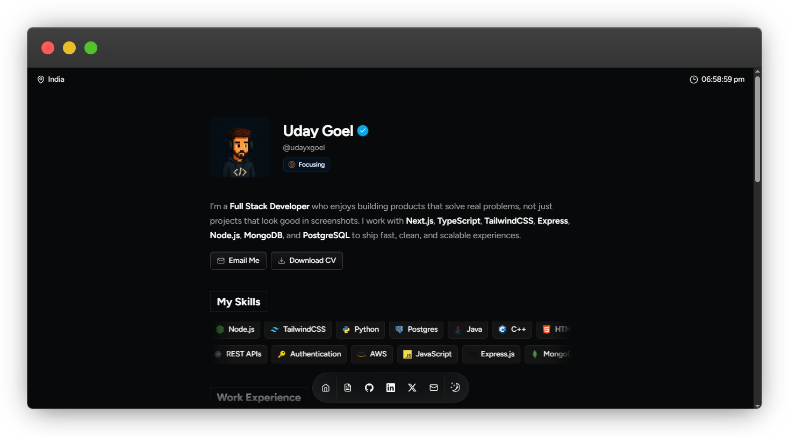

# Portfolio Website



## 💡 Overview

This is my personal portfolio website built with Next.js, TypeScript, and Tailwind CSS. It highlights my profile, skills, work experience, GitHub activity, and featured projects in a clean single-page layout.

The project also includes:

- a Firebase-backed visitor counter with per-device deduplication
- GitHub-powered project sync using repository topics and README parsing
- responsive UI with reusable components and animated sections

## ✨ Features

- **👨‍💻 Personal Portfolio:** Showcases profile, summary, skills, and work experience.
- **📁 GitHub Project Sync:** Pulls project details from GitHub repositories.
- **🖼 README Image Parsing:** Uses the first README image as the project preview.
- **🧰 README Tech Stack Parsing:** Reads the `## Tech Stack` section from each repo README.
- **🏷 Topic-Based Filtering:** Only repositories with the `portfolio` topic are shown.
- **📈 Visitor Counter:** Firebase-powered counter with server-side cookie deduplication.
- **🌗 Modern UI:** Built with Tailwind CSS, Radix UI, and smooth motion effects.
- **📱 Responsive Design:** Works across desktop and mobile layouts.

## 👩‍💻 Tech Stack

- **Next.js**: App Router based React framework.
- **TypeScript**: Type-safe development across the app.
- **Tailwind CSS**: Utility-first styling system.
- **Firebase**: Visitor counter persistence.
- **Radix UI**: Accessible UI primitives.
- **Lucide React**: Icon system used throughout the interface.
- **Framer Motion**: Animation and motion effects.
- **GitHub API**: Fetches repositories and README-based project metadata.

## 📖 Data Sources and Integrations

- [GitHub REST API](https://docs.github.com/en/rest) for repository data and README content
- [Firebase](https://firebase.google.com/docs/firestore) for the visitor counter
- [React GitHub Calendar](https://github.com/grubersjoe/react-github-calendar) for contribution activity

## 📦 Getting Started

To run this project locally, follow these steps.

### 🚀 Prerequisites

- **Node.js** 18 or higher
- **npm**
- A **Firebase project** with Firestore enabled
- Optional: a **GitHub token** for higher API rate limits

## 🛠️ Installation

1. **Clone the repository**

   ```bash
   git clone <your-repo-url>
   cd portfolio
   ```

2. **Install dependencies**

   ```bash
   npm install
   ```

3. **Set up environment variables**

   Create a `.env.local` file in the root directory and add:

   ```env
   NEXT_PUBLIC_FIREBASE_API_KEY=your_firebase_api_key
   NEXT_PUBLIC_FIREBASE_AUTH_DOMAIN=your_project.firebaseapp.com
   NEXT_PUBLIC_FIREBASE_PROJECT_ID=your_project_id
   NEXT_PUBLIC_FIREBASE_STORAGE_BUCKET=your_project.firebasestorage.app
   NEXT_PUBLIC_FIREBASE_MESSAGING_SENDER_ID=your_sender_id
   NEXT_PUBLIC_FIREBASE_APP_ID=your_app_id
   NEXT_PUBLIC_FIREBASE_MEASUREMENT_ID=your_measurement_id

   GITHUB_TOKEN=your_github_token
   ```

4. **Start the development server**

   ```bash
   npm run dev
   ```

5. **Open the app**

   Visit [http://localhost:3000](http://localhost:3000)

## 📖 Usage

### ✔ Running the Website

- **Development:** `npm run dev`
- **Production build:** `npm run build`
- **Production start:** `npm run start`
- **Lint:** `npm run lint`

### 📃 GitHub Project Convention

To make a repository appear in the portfolio:

1. Add the GitHub topic `portfolio`
2. Add the first project image near the top of `README.md`
3. Add a `Tech Stack` section like:

   ```md
   ## Tech Stack

   - Next.js
   - TypeScript
   - Tailwind CSS
   - Firebase
   ```

The portfolio reads:

- **repo name** -> project title
- **repo description** -> project description
- **repo homepage** -> live website link
- **repo URL** -> source link
- **README first image** -> preview image
- **README Tech Stack section** -> technologies

### 📡 API Routes

- `GET /api/visitor-count`
- `POST /api/visitor-count`
- `GET /api/github/repos`

## 🤝 Contributing

Contributions are welcome.

1. Fork the repository
2. Create a branch: `git checkout -b feature/your-feature-name`
3. Make your changes
4. Commit: `git commit -m "Add your feature"`
5. Push: `git push origin feature/your-feature-name`
6. Open a pull request

## 🐛 Issues

If you find a bug or setup issue, please open an issue with:

- a clear title
- a short description of the problem
- steps to reproduce
- screenshots or logs if relevant
- your environment details

## 📜 License

This project is currently for personal portfolio use. Add a license file if you want to distribute it publicly under a specific license.
